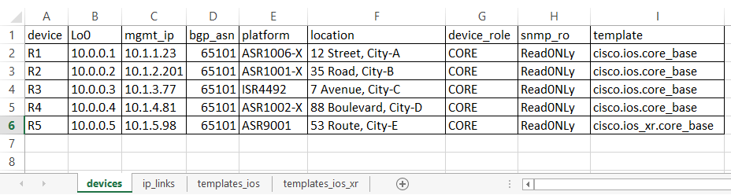
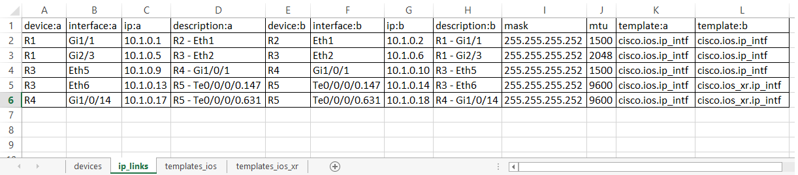
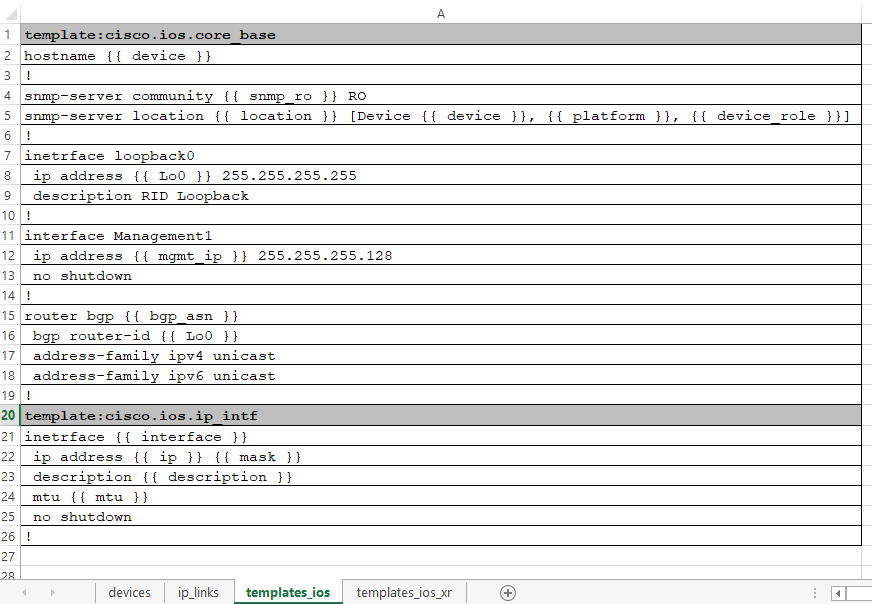
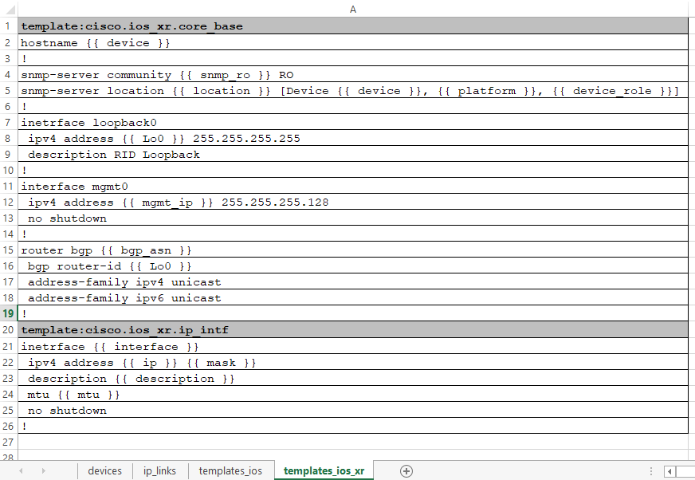

Using TTR with Excel Tables
###########################
   
TTR can source data and templates from Excel spreadsheets, this tutorial is going to show how.

First, make sure to install TTR::

    pip install py-ttr
    
That should also install required libraries such as Jinja2, Openpyxl, PyYAML and Yangson.

After installation, TTR CLI utility should become available for use on your OS, try opening 
terminal window and type ``ttr -h``, if all good, should get similar to below output::

    C:\>ttr -h
    usage: ttr [-h]
    
    TTR CLI, version 0.4.0
    
    optional arguments:
    -h, --help  show this help message and exit
    
    
    Template Text Renderer CLI utility
    
    -d,  --data          OS path to folder with data files or to data file, default ./Data/
    -t,  --templates     OS path to folder, .txt or .xlsx file with template(s), default ./Templates/
    -o,  --output        Output folder location, default ./Output/<current time><data file name>/
    -p,  --print         Print results to terminal instead of saving to folder
    -l,  --logging       Set logging level - "DEBUG", "INFO", "WARNING", "ERROR", "CRITICAL"; default ERROR
    -f,  --filters       Comma separated list of glob patterns to use for filtering data to render

As you can see, TTR version we using for this tutorial is 0.4.0, but it should work same with newer versions.

Defining Data
*************

Next, need to define data, as promised, going to use Excel spreadsheets for that. Create file named 
``sample_data.xlsx``. Going to populate 4 tabs in it.

First tab called "devices" and used to fill in data for device's base parameters such as loopback0 and management IP 
addresses, BGP ASN number, location, platform etc. Tab content is:

Important columns are - "device" and "template", first used as a name to identify results and, for example, used by 
file returner to name text files when saving results to file system, second column refers to templates to render data
with. Except for "template" column, all the columns form actual data used to render templates.

Second tab "ip_links" holds information for point to point links such as device names, interfaces, IP addresses, 
descriptions and MTU:

This tab makes use of 
`multiple templates suffix separation <https://template-text-renderer.readthedocs.io/en/latest/Data%20Loader%20Plugins.html#multiple-templates-suffix-separation>`_
to simplify links definition in a way that single link requires only one table row to define it.

Above two tabs form data component, additional rows can be added as required, more tabs can be included as well
to describe network functionality. 

Defining Templates
******************

Now is the turn to define templates to render above data. TTR supports sourcing templates content
from excel spreadsheets - any tab with name that starts with "templates" considered to contain
templates and used by TTR to load templates content.

Templates in this example separated across two tabs for demonstration purposes. However, it is
an excel spreadsheet and nothing stopping us from putting all templates on one tab or adding more tabs
if we think it better suite our design goals.

Here is the content of "templates_ios" tab:

And this is the content of "templates_ios_xr" tab:

As demonstrated above, templates are in fact Jinja2 templates. Each template definition starts with
a row ``template:<template name>`` where ``template name`` referred by data tabs' ``template`` columns.

Each ``template name`` must be unique across all templates, naming convention for templates' names is 
arbitrary from TTR perspectives and can be defined based on user preference.

Generating Text Results
***********************

The simplest way to produce results is to use TTR CLI utility, execute below command from folder with 
``table_ttr_with_excel_tutorial.xlsx`` file::

    ttr -d table_ttr_with_excel_tutorial.xlsx -p
     
and TTR should print rendering results to terminal screen::

    TBD

Outputting result to terminal is good if amount of output is fairly small or for debugging purposes,
better way is to let TTR output result in a folder on the local file system, for that need to run same
command as above but without ``-p`` argument::

    ttr -d table_ttr_with_excel_tutorial.xlsx
        
If all is well, TTR should create ``Output`` folder within current directory with subdirectory containing
per-device rendering results::

    TBD
    
Next Steps
**********

Data and templates does not have to be defined inside of the same Excel document, in fact it is better
to keep them separate. For example we move templates to ``templates.xlsx`` spreadsheet we can use this 
command to generate results::

    ttr -d table_ttr_with_excel_tutorial.xlsx -t templates.xlsx
    
Keeping templates and actual data in separate files will allow to add more data spreadsheets where all of
them can reference templates from single source.

Moreover, templates can be defined within, for instance, ``Templates`` folder using text files, where each
file name must be same as the value used in data tables' ``template`` columns. The benefit of using text files
is capability to simplify version control using for example GIT.

Data can contain errors, excel features can help to spot and fix some of them, but additional layer of protection
can be provided by YANG models. YANG models can define what is mandatory or optional, can check values types - is 
it an integer or a string, is it matching regular expression or integer value falls within certain range etc. That 
will help to make sure that templates supplied with verified data, lowering the probability of having errors in 
your devices' configurations.

Conclusion
**********

In a few seconds seconds with a single command TTR can produce network devices configurations out of excel table,
that can be very powerful tool to streamline the process of building consistent configuration using a collection 
of tested and verified templates. Introducing fixes becomes easier, adding new devices becomes a matter of populating 
excel spreadsheet. Excel formulas can help to simplify editing, deleting, sorting and searching through your data.

Hope this tutorial was useful, thank you for reading.

``table_ttr_with_excel_tutorial.xlsx`` can be downloaded from `TTR GitHub repository <https://github.com/dmulyalin/template-text-renderer/tree/master/tests/mock_data>`_